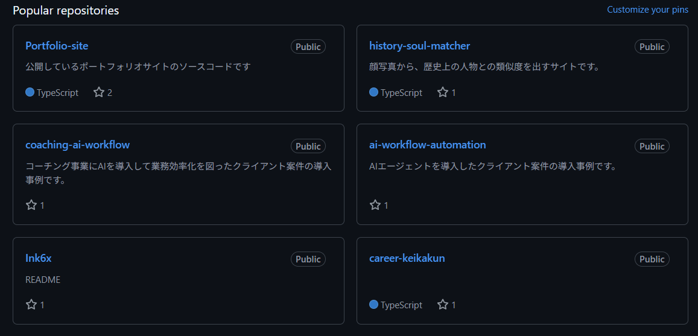
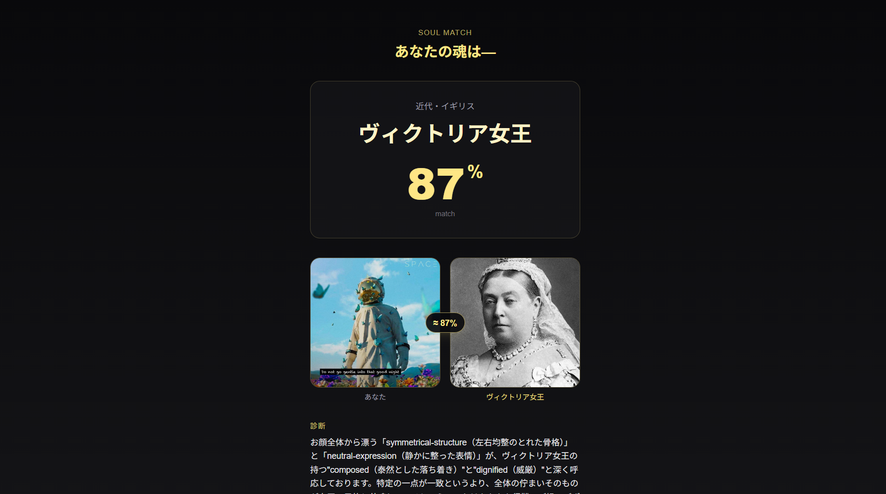

<div align="center">
  

  <p>
    <a href="https://history-soul-matcher.vercel.app">
      
    </a>
    <a href="https://github.com/Ink6x/history-soul-matcher/actions/workflows/ci.yml">
      
    </a>
    
    
    
    
    
  </p>

  <p>
    <a href="https://history-soul-matcher.vercel.app"><strong>→ Try the App</strong></a>
    &nbsp;&nbsp;|&nbsp;&nbsp;
    <a href="docs/ARCHITECTURE.md"><strong>Architecture</strong></a>
    &nbsp;&nbsp;|&nbsp;&nbsp;
    <a href="README.md"><strong>日本語</strong></a>
  </p>
</div>

---

## What It Does

**History Soul Matcher** finds the historical figure whose soul most resembles yours — based on a selfie.

Upload a photo → Claude Vision extracts 8 facial feature axes as structured data → a deterministic scoring function matches you against 200 historical figures → Claude generates a narrative citing your top matching features.

> **Role:** Solo — requirements, architecture, implementation, dataset construction, and production ops.

---

## The Core Engineering Challenge

The naive approach — "send the photo and figure list to an LLM and ask it to pick the best match" — has a critical flaw: **popularity bias**. LLMs trained on internet text disproportionately return famous figures (Napoleon, Einstein) regardless of facial similarity, and the selection is non-reproducible across runs.

The solution is a **3-stage pipeline** that separates concerns:

```
Stage 1: extractUserFeatures()   ← Claude Vision + Tool Use
         photo → 8-axis structured features (closed enums)

Stage 2: scoreFigures()          ← Pure function (no LLM)
         features × 200-figure dataset → highest-score figure

Stage 3: generateNarrative()     ← Claude (separate Tool)
         top features + figure → reason / episode / quote
```

**Why this matters:**
- Stage 2 is a pure function — same input always returns the same figure, fully testable (43 tests)
- Hallucination risk is contained to the narrative layer (Stage 3), not the selection logic
- Scoring weight changes appear as code diffs, reviewable by humans

For the full rationale, see [docs/adr/](docs/adr/) (7 Architecture Decision Records).

---

## Screenshots

<div align="center">
  <table>
    <tr>
      <td align="center"><b>Upload</b></td>
      <td align="center"><b>Analyzing</b></td>
      <td align="center"><b>Result</b></td>
    </tr>
    <tr>
      <td></td>
      <td></td>
      <td></td>
    </tr>
  </table>
</div>

---

## Tech Stack

| Layer | Technology |
|-------|-----------|
| Framework | Next.js 16.2 (App Router) |
| UI | React 19.2 / Tailwind CSS 4 |
| Language | TypeScript 5 (strict mode) |
| AI | Anthropic Claude — Vision + Tool Use (`@anthropic-ai/sdk` 0.95) |
| Schema validation | Zod 4 |
| OGP | `@vercel/og` 0.11 |
| Rate limiting | Upstash Redis |
| Deploy | Vercel (hnd1 region) |

---

## Key Design Decisions

| Decision | Choice | Why |
|----------|--------|-----|
| Figure selection | Pure function (Stage 2) | Reproducibility, testability, no popularity bias |
| Output enforcement | Tool Use + closed enums | Schema violations are structurally impossible for the model |
| Image transfer | FormData (multipart) | Avoids Vercel's 4.5 MB JSON limit; base64 adds ~33% overhead |
| API layer | Route Handler (not Server Action) | Fine-grained HTTP status control; multi-client ready |
| Model per stage | Haiku (Stage 1) / Sonnet (Stage 3) | Cost-optimized classification vs. quality narrative |
| Cost optimization | Prompt Caching on system prompts | ~90% token discount on cache hits |

---

## Getting Started

### Prerequisites

- Node.js 20+ (`.nvmrc` included)
- Anthropic API key ([console.anthropic.com](https://console.anthropic.com/))

### Setup

```bash
git clone https://github.com/Ink6x/history-soul-matcher.git
cd history-soul-matcher
npm install
cp .env.example .env.local
# Set ANTHROPIC_API_KEY in .env.local
npm run dev   # → http://localhost:3000
```

### Environment Variables

| Variable | Required | Description |
|----------|----------|-------------|
| `ANTHROPIC_API_KEY` | ✅ | Anthropic Console API key |
| `CLAUDE_EXTRACT_MODEL` | — | Default: `claude-haiku-4-5-20251001` |
| `CLAUDE_NARRATIVE_MODEL` | — | Default: `claude-sonnet-4-6` |
| `UPSTASH_REDIS_REST_URL` | — | Rate limiting (fails open if unset) |
| `UPSTASH_REDIS_REST_TOKEN` | — | Rate limiting (fails open if unset) |

### Commands

```bash
npm run dev          # Dev server
npm run build        # Production build
npm run lint         # ESLint
npm run typecheck    # tsc --noEmit
npm test             # Vitest (43 tests)
```

---

## Documentation

| Document | Contents |
|----------|---------|
| [docs/ARCHITECTURE.md](docs/ARCHITECTURE.md) | System design, scoring algorithm, data model |
| [docs/adr/](docs/adr/) | 7 Architecture Decision Records |
| [docs/PROMPT_DESIGN.md](docs/PROMPT_DESIGN.md) | Prompt engineering rationale, Tool Use schema |
| [docs/DATASET.md](docs/DATASET.md) | 200-figure dataset structure and extension guide |

---

## Known Limitations

- Dataset skews toward figures with surviving portraits (Western Europe, East Asia)
- 8-axis enum granularity can't capture all intermediate facial features
- Scoring weights are evenly distributed (10 pts each) — not statistically optimized
- Vercel Hobby `maxDuration: 30s` may time out on large images with Sonnet

---

## Privacy

- Uploaded images are processed in memory only and discarded after the response
- The API key is never exposed to the client or logs
- Prompts explicitly prohibit asserting the subject's age, ethnicity, or gender

---

## Contributing

See [CONTRIBUTING.md](CONTRIBUTING.md) for dev setup, branch conventions, and the pipeline invariants you must not break.

---

## License

[MIT](LICENSE) © 2026 [Ink6x](https://github.com/Ink6x)
