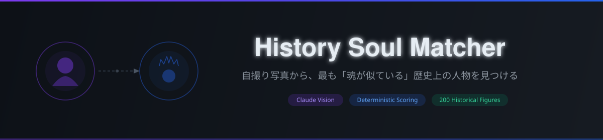

<div align="center">
  

  <p>
    <a href="https://history-soul-matcher.vercel.app">
      
    </a>
    
    
    
    
    
    
  </p>

  <p>
    <a href="https://history-soul-matcher.vercel.app"><strong>→ アプリを試す</strong></a>
    &nbsp;&nbsp;|&nbsp;&nbsp;
    <a href="docs/ARCHITECTURE.md"><strong>アーキテクチャ詳細</strong></a>
  </p>
</div>

---

## 概要

**History Soul Matcher** は、アップロードした自撮り写真から「最も魂が似ている歴史上の人物」を見つけるWebアプリです。

Claude Vision で顔の特徴を8軸で構造化抽出し、200名の歴史人物データセットに対して決定論的にスコアリングしたうえで、一致した特徴を根拠としたナラティブを生成します。「LLMに判断と物語生成を一度にやらせない」という原則を3段パイプラインで実装しています。

> **Role:** 要件定義 / アーキテクチャ設計 / 実装 / データセット構築 / 運用設計をソロで担当。

---

## 特徴

- **構造化特徴抽出** — Claude Vision + Tool Use + 閉じた enum で顔特徴を8軸スキーマに強制変換。スキーマ違反をモデルが表現できない設計
- **決定論的スコアリング** — 人物選定は純関数（LLM不使用）で処理。同じ入力に対して常に同じ人物が返る再現性を保証
- **根拠付きナラティブ** — 上位3特徴を明示したうえでエピソード・引用を生成。理由が追跡可能
- **200名データセット** — 日本史 / 西洋政治 / 科学 / 芸術 / 宗教哲学 / 東洋 / 神話 / その他の8カテゴリ
- **動的OGP画像** — `@vercel/og` でシェア時に結果カードを自動生成
- **プライバシーファースト** — アップロード画像はメモリ上のみで処理し、リクエスト完了後に即廃棄

---

## 技術スタック

| レイヤー | 技術 |
|---------|------|
| フレームワーク | Next.js 16.2（App Router） |
| UI | React 19.2 / Tailwind CSS 4 |
| 言語 | TypeScript 5（strict mode） |
| AI | Anthropic Claude — Vision + Tool Use（`@anthropic-ai/sdk` 0.95） |
| スキーマ検証 | Zod 4 |
| OGP | `@vercel/og` 0.11 |
| レート制限 | Upstash Redis |
| デプロイ | Vercel（hnd1リージョン） |

---

## はじめかた

### 前提条件

- Node.js 20 以上
- Anthropic API キー（[console.anthropic.com](https://console.anthropic.com/) で発行）

### インストール

```bash
git clone https://github.com/Ink6x/history-soul-matcher.git
cd history-soul-matcher
npm install
cp .env.example .env.local
```

### 環境変数

`.env.local` に以下を設定します。

| 変数 | 必須 | 説明 |
|------|------|------|
| `ANTHROPIC_API_KEY` | ✅ | Anthropic Console で発行した API キー |
| `CLAUDE_MODEL` | — | 省略時 `claude-sonnet-4-6`。タイムアウト退避時は `claude-haiku-4-5` 等に切替可能 |

### 開発サーバー起動

```bash
npm run dev
# → http://localhost:3000
```

| コマンド | 説明 |
|---------|------|
| `npm run dev` | 開発サーバー起動 |
| `npm run build` | プロダクションビルド |
| `npm run lint` | ESLint |

---

## アーキテクチャ

```
[ブラウザ]
  └─ 画像選択・long edge 1024px / 3MB 以下にリサイズ
  └─ FormData で POST /api/analyze
         │
         ▼ multipart/form-data
  [Route Handler]  runtime: nodejs / maxDuration: 30s
         │
         ├─ Stage 1: extractUserFeatures()   ← Claude Vision + Tool Use
         │            写真 → 8軸の構造化特徴
         │
         ├─ Stage 2: scoreFigures()          ← 純関数（LLM不使用）
         │            特徴 × 200名データセット → 最高スコア人物
         │
         └─ Stage 3: generateNarrative()     ← Claude（別 Tool）
                      上位特徴 + 人物 → 理由・エピソード・引用
         │
         ▼ JSON（Zod 検証済み）
  [結果ページ] + /api/og で動的OGP画像生成
```

設計思想・スコアリングアルゴリズム・データモデルの詳細は **[docs/ARCHITECTURE.md](docs/ARCHITECTURE.md)** を参照してください。

---

## Vercel へのデプロイ

1. このリポジトリを Vercel にインポート
2. `ANTHROPIC_API_KEY`（必要なら `CLAUDE_MODEL`）を Environment Variables に追加
3. Hobby プランでは `/api/analyze` の `maxDuration` を 30 以内に維持（デフォルトで 30）

タイムアウトが頻発する場合は、コード変更なしに `CLAUDE_MODEL=claude-haiku-4-5` へ切り替えできます。

---

## プライバシー

- アップロード画像は Route Handler のメモリ上のみで処理し、レスポンス返却後に破棄します。**ファイルシステム・DB・ログには保存しません**
- API キーはサーバーサイドの環境変数のみから参照し、クライアントやレスポンスには出力しません
- 写真に写る人物の年齢・人種・性別を断定しないことをプロンプトで明示しています

---

## ライセンス

[MIT](LICENSE) © 2026 [Ink6x](https://github.com/Ink6x)
